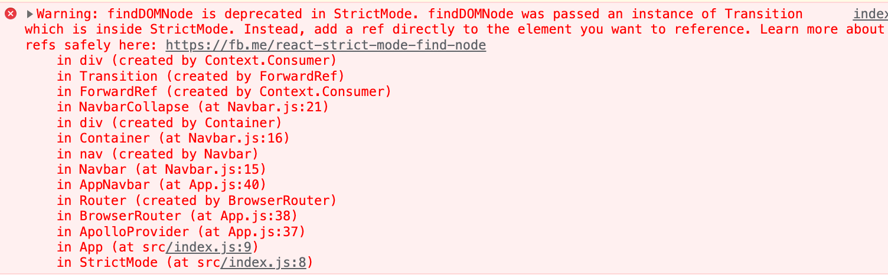
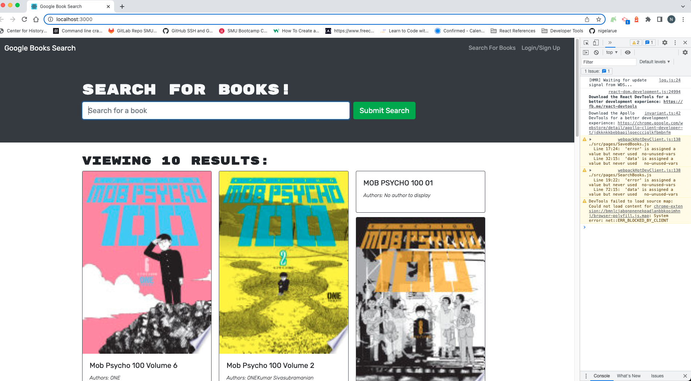

# Book Search Engine

## Table of Contents:

1. [Description](#description)
2. [Installation](#installation)
3. [Usage](#usage)
4. [Issues](#Issues)
5. [Contributing](#contributing)
6. [Links](#links)
7. [Issues](#Issues)

## Description

This project is an already functioning RESTful API Google Books search engine. I have reworked the code to run as a GraphQL API built with Apollo Server. The app was built using the MERN stack with a React front end, MongoDB database, and Node.js/Express.js server and API.

To complete the updates to the code to be a GraphQL API build with Apollo Server, the following updates were made:

1. Created Apollo Server schema and used GraphQL queries and mutations to fetch and modify data, replacing the existing RESTful API.

2. Modified the existing authentication middleware so that it works in the context of a GraphQL API.

3. Created an Apollo Provider so that requests can communicate with an Apollo Server.

4. Deployed to Heroku with a MongoDB database using MongoDB Atlas. 

## Installation

Apollo Client & Server is required to use this app, along with Mongo, Express, React and Node.js.

## Contributing

[Nigel LaRue](https://github.com/nigelarue).
[Xandromus](https://github.com/coding-boot-camp/solid-broccoli) provided the starter code.

## Given User Story

```md
AS AN avid reader
I WANT to search for new books to read
SO THAT I can keep a list of books to purchase
```

## Given Acceptance Criteria

```md
GIVEN a book search engine
WHEN I load the search engine
THEN I am presented with a menu with the options Search for Books and Login/Signup and an input field to search for books and a submit button
WHEN I click on the Search for Books menu option
THEN I am presented with an input field to search for books and a submit button
WHEN I am not logged in and enter a search term in the input field and click the submit button
THEN I am presented with several search results, each featuring a book’s title, author, description, image, and a link to that book on the Google Books site
WHEN I click on the Login/Signup menu option
THEN a modal appears on the screen with a toggle between the option to log in or sign up
WHEN the toggle is set to Signup
THEN I am presented with three inputs for a username, an email address, and a password, and a signup button
WHEN the toggle is set to Login
THEN I am presented with two inputs for an email address and a password and login button
WHEN I enter a valid email address and create a password and click on the signup button
THEN my user account is created and I am logged in to the site
WHEN I enter my account’s email address and password and click on the login button
THEN I the modal closes and I am logged in to the site
WHEN I am logged in to the site
THEN the menu options change to Search for Books, an option to see my saved books, and Logout
WHEN I am logged in and enter a search term in the input field and click the submit button
THEN I am presented with several search results, each featuring a book’s title, author, description, image, and a link to that book on the Google Books site and a button to save a book to my account
WHEN I click on the Save button on a book
THEN that book’s information is saved to my account
WHEN I click on the option to see my saved books
THEN I am presented with all of the books I have saved to my account, each featuring the book’s title, author, description, image, and a link to that book on the Google Books site and a button to remove a book from my account
WHEN I click on the Remove button on a book
THEN that book is deleted from my saved books list
WHEN I click on the Logout button
THEN I am logged out of the site and presented with a menu with the options Search for Books and Login/Signup and an input field to search for books and a submit button  
```
## Links

[Heroku Link](https://obscure-garden-85803.herokuapp.com/).
[GitHub Repo Link](https://github.com/nigelarue/MERNugladIdidntsayBanana).

## Issues

As is common with a lot of older code, many packages and components of those packages are deprecated. I ran into this issue a lot with React's findDOMNode when I ran tests and development (see below photos). Please note that updating the packages might cause errors to propogate. 
.
.

## Contact

Please email me at: larue.nigel91@gmail.com or submit a ticket to the GitHub repository for questions or updates.